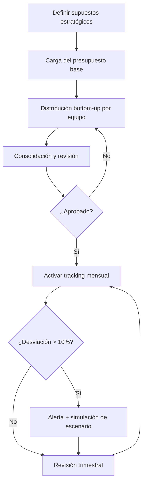

# Budget Command Center — Best Practices

## Benchmark: Cómo lo hacen las herramientas líderes

### Anaplan
- Planificación conectada: datos fluyen entre modelos financieros sin silos.
- Escenarios what-if en tiempo real con múltiples variables.
- Flujos de aprobación configurables con roles y permisos granulares.
- Versiones de plan (Base, Optimista, Pesimista) con comparativas.

### Vareto
- Presupuestación colaborativa con comentarios en celda y chat en contexto.
- Alertas automáticas cuando el gasto supera umbrales configurados.
- Integración directa con herramientas contables (QuickBooks, NetSuite).

### Cube
- Planificación bidireccional (bottom-up desde equipos + top-down desde dirección).
- Consolidación automática de presupuestos de múltiples departamentos.
- Reporting a medida sin necesidad de exportar a Excel.

---

## KPIs recomendados

| KPI | Descripción | Umbral de alerta |
|-----|-------------|-----------------|
| Desviación presupuestaria | % diferencia entre real y presupuestado | > 10% → alerta |
| Burn rate | Velocidad de consumo del presupuesto | > 110% del ritmo planificado |
| Forecast accuracy | Precisión del forecast vs. cierre real | < 85% → revisar modelo |
| Budget utilization | % del presupuesto comprometido | < 70% al Q3 → redistribuir |
| Escenario gap | Diferencia entre escenarios optimista y pesimista | > 30% → aumentar contingencia |

---

## Flujo típico de gestión presupuestaria

---

## Protocolo de actuación estándar

1. **Definir supuestos del período** — Inflación, crecimiento esperado, nuevas inversiones.
2. **Cargar presupuesto base** — Por departamento, línea de producto, región.
3. **Simulación de escenarios** — Optimista (+15%), base (0%), pesimista (-15%).
4. **Revisión y aprobación** — Flujo de aprobación con firmas requeridas.
5. **Tracking mensual** — Comparar real vs. presupuestado con drill-down.
6. **Re-forecast trimestral** — Ajustar proyecciones con datos reales acumulados.

---

## Errores comunes

- **Presupuesto estático**: No actualizar el forecast con datos reales genera ceguera.
- **Sin escenarios**: Un solo escenario no permite prepararse para la volatilidad.
- **Sin aprobaciones documentadas**: Falta de trazabilidad en cambios presupuestarios.
- **Silos departamentales**: Presupuestos no consolidados generan incoherencias.
- **Revisión solo anual**: La frecuencia mínima recomendada es trimestral.

---

## Automatizaciones recomendadas

- Si desviación > 10% → **Alerta automática** al responsable + sugerencia de acción.
- Si burn rate supera el 110% → **Notificación** con simulación de impacto al cierre.
- Exportación mensual automática a PDF/Excel para informes ejecutivos.
- Re-forecast automático con datos reales al cierre de cada mes.
