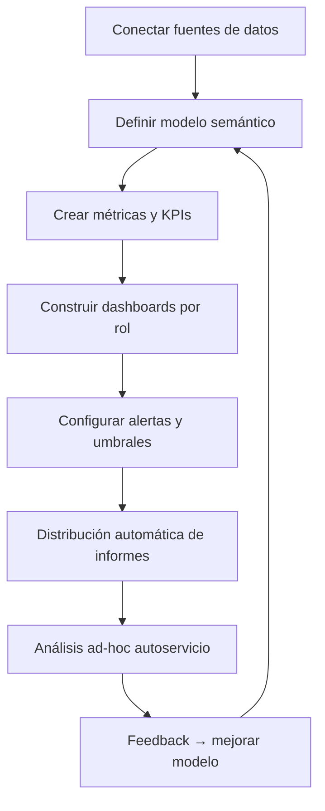

# Business Intelligence — Best Practices

## Benchmark: Cómo lo hacen las herramientas líderes

### Looker
- Exploración semántica de datos con LookML (capa semántica compartida).
- Dashboards embebibles en cualquier aplicación.
- Alertas basadas en umbrales configurables con entrega por email/Slack.
- Control de acceso granular por departamento o rol.

### Domo
- Integración nativa con cientos de fuentes (Salesforce, Google Analytics, SQL…).
- Tarjetas de BI con comentarios y colaboración en contexto.
- Mobile-first: dashboards optimizados para dispositivos móviles.

### ThoughtSpot
- Búsqueda en lenguaje natural: "¿Cuáles son mis 10 clientes con más ingresos este trimestre?"
- SpotIQ: análisis automático de insights anómalos.
- Liveboards con datos en tiempo real sin necesidad de SQL.

---

## KPIs recomendados

| KPI | Descripción | Frecuencia |
|-----|-------------|-----------|
| Revenue por período | Ingresos totales por día/semana/mes | Diaria |
| Pipeline coverage | Ratio pipeline / objetivo de cierre | Semanal |
| Win rate | % de oportunidades ganadas | Mensual |
| ACV (Average Contract Value) | Valor medio de contrato | Mensual |
| CAC (Customer Acquisition Cost) | Coste de adquisición por cliente | Trimestral |
| LTV (Lifetime Value) | Valor de vida del cliente | Trimestral |

---

## Flujo típico de BI

---

## Protocolo de actuación estándar

1. **Definir fuentes de datos** — CRM, ERP, base de datos propia, fuentes externas.
2. **Crear modelo semántico** — Métricas de negocio con definiciones acordadas.
3. **Segmentar por audiencia** — Dashboard diferente para dirección, comerciales, operaciones.
4. **Configurar alertas** — Umbrales para KPIs críticos con notificación automática.
5. **Programar informes** — Envío automático semanal/mensual a stakeholders.
6. **Capacitar en autoservicio** — Los usuarios deben poder explorar sin IT.

---

## Errores comunes

- **Dashboard único para todos**: Las necesidades de dirección difieren de las de los comerciales.
- **Sin alertas**: Los dashboards pasivos requieren que alguien los mire; las alertas son proactivas.
- **Datos desactualizados**: La frecuencia de actualización debe alinearse con la cadencia de decisiones.
- **Métricas sin dueño**: Cada KPI debe tener un responsable y una definición única.
- **Sobrecargar el dashboard**: Más de 7-10 métricas en una vista reduce la atención.

---

## Automatizaciones recomendadas

- Informe ejecutivo automático cada lunes con los 5 KPIs principales.
- Alerta si revenue semanal cae más del 15% vs. semana anterior.
- Análisis de anomalías automático con resumen de causas probables.
- Distribución segmentada por rol del informe mensual de negocio.
