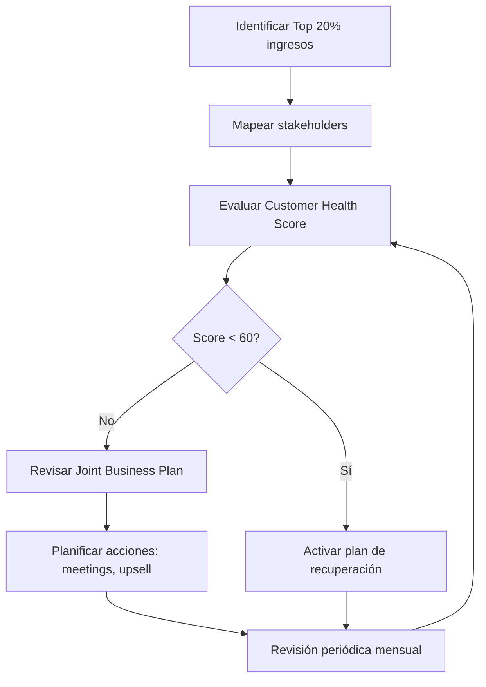

# Key Account Management — Best Practices

## Benchmark: Cómo lo hacen las herramientas líderes

### Gainsight
- Customer Health Score compuesto (uso del producto, NPS, soporte, relación financiera).
- Playbooks automáticos disparados por caídas del health score.
- 360° account view con timeline de todas las interacciones.

### Salesforce CRM
- Relationship maps visuales con stakeholders y niveles de influencia.
- Joint Business Plans (JBP) colaborativos con el cliente.
- Alertas de riesgo basadas en inactividad o cambios en el contacto clave.

### HubSpot Sales Hub
- Scoring de contactos y empresas basado en actividad.
- Secuencias de follow-up automáticas según etapa de relación.
- Integraciones nativas con email y calendario.

---

## KPIs recomendados

| KPI | Descripción | Umbral de alerta |
|-----|-------------|-----------------|
| Customer Health Score | Puntuación 0-100 de salud de la cuenta | < 60 → alerta roja |
| Engagement Rate | % de respuestas a comunicaciones | < 30% → acción inmediata |
| Upsell Potential | Estimación de expansión de ingresos | > 20% → priorizar |
| Days Since Last Contact | Días desde último contacto | > 30 → sugerir acción |
| Revenue Trend (3M) | Tendencia de ingresos últimos 3 meses | Negativo 2 meses → plan recuperación |
| NPS | Net Promoter Score | < 0 → alerta roja |

---

## Flujo típico de gestión de cuentas clave

---

## Protocolo de actuación estándar

1. **Identificar cuentas estratégicas** — Top 20% por ingresos o potencial estratégico.
2. **Mapear stakeholders** — Identificar decisores, influenciadores y usuarios finales.
3. **Evaluar salud de la relación** — NPS, frecuencia de contacto, satisfacción.
4. **Plan de acciones** — Meetings trimestral, follow-ups mensuales, propuestas de upselling.
5. **Joint Business Plan** — Objetivos compartidos documentados y revisados.
6. **Alertas de riesgo** — Monitoreo continuo con escalado automático.

---

## Errores comunes

- **No priorizar cuentas**: Tratar todas las cuentas igual lleva a descuidar las más valiosas.
- **Falta de Joint Business Plan**: Sin objetivos compartidos, la relación no evoluciona.
- **Contacto único**: Depender de un solo contacto expone la cuenta a rotación de personal.
- **Sin medición de health score**: Incapacidad de detectar señales de churn anticipadamente.
- **Revisiones solo reactivas**: El KAM debe ser proactivo, no esperar problemas.

---

## Automatizaciones recomendadas

- Si NPS < 0 → **Alerta roja** + sugerir meeting de recuperación urgente.
- Si sin contacto > 30 días → **Sugerir acción** de follow-up con mensaje personalizado.
- Si ingresos bajan 2 meses consecutivos → **Disparar plan de recuperación**.
- Si health score cae 15 puntos en un mes → **Notificación al manager**.
